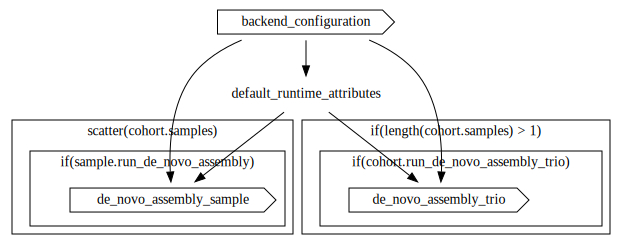

<h1 align="center"></h1>

<h1 align="center">PacBio Human _De novo_ Assembly Pipeline</h1>

Workflow for running de novo assembly using human PacBio whole genome sequencing (WGS) data. Written using [Workflow Description Language (WDL)](https://openwdl.org/).

- Docker images used by these workflows are defined [here](https://github.com/PacificBiosciences/wdl-dockerfiles).
- Common tasks that may be reused within or between workflows are defined [here](https://github.com/PacificBiosciences/wdl-common).

# Workflow

**Workflow entrypoint**: [workflows/main.wdl](workflows/main.wdl)

The assembly workflow performs _de novo_ assembly on samples and trios.



## Setup

Some tasks and workflows are pulled in from other repositories. Ensure you have initialized submodules following cloning by running `git submodule update --init --recursive`.

## Resource requirements

The workflow requires at minimum 48 cores and 288 GB of RAM. Ensure that the backend environment you're using has enough quota to run the workflow.

## Reference datasets and associated workflow files

Reference datasets are hosted publicly for use in the pipeline. For data locations, see the [backend-specific documentation](backends/) and template inputs files for each backend with paths to publicly hosted reference files filled out.

# Running the workflow

1. [Select a backend environment](#selecting-a-backend)
2. [Configure a workflow execution engine in the chosen environment](#configuring-a-workflow-engine)
3. [Fill out the inputs JSON file for your cohort](#filling-out-the-inputs-json)
4. [Run the workflow](#running-the-workflow-1)

## Selecting a backend

The workflow can be run on Azure, AWS, GCP, or HPC. Your choice of backend will largely be determined by the location of your data.

For backend-specific configuration, see the relevant documentation:

- [Azure](backends/azure)
- [AWS](backends/aws)
- [GCP](backends/gcp)
- [HPC](backends/hpc)

## Configuring a workflow engine and container runtime

An execution engine is required to run workflows. Two popular engines for running WDL-based workflows are [`miniwdl`](https://miniwdl.readthedocs.io/en/latest/getting_started.html) and [`Cromwell`](https://cromwell.readthedocs.io/en/stable/tutorials/FiveMinuteIntro/).

Because workflow dependencies are containerized, a container runtime is required. This workflow has been tested with [Docker](https://docs.docker.com/get-docker/) and [Singularity](https://docs.sylabs.io/guides/3.10/user-guide/) container runtimes.

See [backend-specific documentation](backends) for details on setting up an engine.

| Engine | Azure | AWS | GCP | HPC |
| :- | :- | :- | :- | :- |
| [**miniwdl**](https://github.com/chanzuckerberg/miniwdl#scaling-up) | _Unsupported_ | Supported via the [Amazon Genomics CLI](https://aws.amazon.com/genomics-cli/) | _Unsupported_ | (SLURM only) Supported via the [`miniwdl-slurm`](https://github.com/miniwdl-ext/miniwdl-slurm) plugin |
| [**Cromwell**](https://cromwell.readthedocs.io/en/stable/backends/Backends/) | Supported via [Cromwell on Azure](https://github.com/microsoft/CromwellOnAzure) | Supported via the [Amazon Genomics CLI](https://aws.amazon.com/genomics-cli/) | Supported via Google's [Pipelines API](https://cromwell.readthedocs.io/en/stable/backends/Google/) | Supported - [Configuration varies depending on HPC infrastructure](https://cromwell.readthedocs.io/en/stable/tutorials/HPCIntro/) |

## Filling out the inputs JSON

The input to a workflow run is defined in JSON format. Template input files with reference dataset information filled out are available for each backend:

- [Azure](backends/azure/inputs.azure.json)
- [AWS](backends/aws/inputs.aws.json)
- [GCP](backends/gcp/inputs.gcp.json)
- [HPC](backends/hpc/inputs.hpc.json)

Using the appropriate inputs template file, fill in the cohort and sample information (see [Workflow Inputs](#workflow-inputs) for more information on the input structure).

If using an HPC backend, you will need to download the reference bundle and replace the `<local_path_prefix>` in the input template file with the local path to the reference datasets on your HPC.

## Running the workflow

Run the workflow using the engine and backend that you have configured ([miniwdl](#run-directly-using-miniwdl), [Cromwell](#run-directly-using-cromwell)).

Note that the calls to `miniwdl` and `Cromwell` assume you are accessing the engine directly on the machine on which it has been deployed. Depending on the backend you have configured, you may be able to submit workflows using different methods (e.g. using trigger files in Azure, or using the Amazon Genomics CLI in AWS). 

### Run directly using miniwdl

`miniwdl run workflows/main.wdl -i <input_file_path.json>`

### Run directly using Cromwell

`java -jar <cromwell_jar_path> run workflows/main.wdl -i <input_file_path.json>`

If Cromwell is running in server mode, the workflow can be submitted using cURL. Fill in the values of CROMWELL_URL and INPUTS_JSON below, then from the root of the repository, run:

```bash
# The base URL (and port, if applicable) of your Cromwell server
CROMWELL_URL=
# The path to your inputs JSON file
INPUTS_JSON=

(cd workflows && zip -r dependencies.zip assembly_structs.wdl assemble_genome/ de_novo_assembly_sample/ de_novo_assembly_trio/ wdl-common/)
curl -X "POST" \
  "${CROMWELL_URL}/api/workflows/v1" \
  -H "accept: application/json" \
  -H "Content-Type: multipart/form-data" \
  -F "workflowSource=@workflows/main.wdl" \
  -F "workflowInputs=@${INPUTS_JSON};type=application/json" \
  -F "workflowDependencies=@workflows/dependencies.zip;type=application/zip"
```

To specify [workflow options](https://cromwell.readthedocs.io/en/latest/wf_options/Overview/), add the following to the request (assuming your options file is a file called `options.json` located in the `pwd`): `-F "workflowOptions=@options.json;type=application/json"`.

# Workflow inputs

This section describes the inputs required for a run of the workflow. Typically, only the `de_novo_assembly.cohort` and potentially [run/backend-specific sections](#other-inputs) will be filled out by the user for each run of the workflow. Input templates with reference file locations filled out are provided [for each backend](backends).

## [Cohort](workflows/humanwgs_structs.wdl)

A cohort can include one or more samples. Samples need not be related.

| Type | Name | Description | Notes |
| :- | :- | :- | :- |
| String | cohort_id | A unique name for the cohort; used to name outputs | |
| Array[[Sample](#sample)] | samples | The set of samples for the cohort. At least one sample must be defined. | |
| Boolean | run_de_novo_assembly_trio | Run trio binned _de novo_ assembly. | Cohort must contain at least one valid trio (child and both parents present in the cohort) |

### [Sample](workflows/humanwgs_structs.wdl)

Sample information for each sample in the workflow run.

| Type | Name | Description | Notes |
| :- | :- | :- | :- |
| String | sample_id | A unique name for the sample; used to name outputs | |
| Array[[IndexData](https://github.com/PacificBiosciences/wdl-common/blob/main/wdl/structs.wdl)] | movie_bams | The set of unaligned movie BAMs associated with this sample | |
| String? | father_id | Paternal `sample_id` | |
| String? | mother_id | Maternal `sample_id` | |
| Boolean | run_de_novo_assembly | If true, run single-sample _de novo_ assembly for this sample | \[true, false\] |

## [ReferenceData](workflows/humanwgs_structs.wdl)

Array of references and their associated names and indices.

These files are hosted publicly in each of the cloud backends; see `backends/${backend}/inputs.${backend}.json`.

| Type | Name | Description | Notes |
| :- | :- | :- | :- |
| String | name | Reference name; used to name outputs (e.g., "GRCh38") | |
| [IndexData](https://github.com/PacificBiosciences/wdl-common/blob/main/wdl/structs.wdl) | fasta | Reference genome and associated index | |

## Other inputs

| Type | Name | Description | Notes |
| :- | :- | :- | :- |
| String | backend | Backend where the workflow will be executed | \["Azure", "AWS", "GCP", "HPC"\] |
| String? | zones | Zones where compute will take place; required if backend is set to 'AWS' or 'GCP'. | <ul><li>[Determining available zones in AWS](backends/aws/README.md#determining-available-zones)</li><li>[Determining available zones in GCP](backends/gcp/README.md#determining-available-zones)</li></ul> |
| String? | aws_spot_queue_arn | Queue ARN for the spot batch queue; required if backend is set to 'AWS' and `preemptible` is set to `true` | [Determining the AWS queue ARN](backends/aws/README.md#determining-the-aws-batch-queue-arn) |
| String? | aws_on_demand_queue_arn | Queue ARN for the on demand batch queue; required if backend is set to 'AWS' and `preemptible` is set to `false` | [Determining the AWS queue ARN](backends/aws/README.md#determining-the-aws-batch-queue-arn) |
| String? | container_registry | Container registry where workflow images are hosted. If left blank, [PacBio's public Quay.io registry](https://quay.io/organization/pacbio) will be used. | |
| Boolean | preemptible | If set to `true`, run tasks preemptibly where possible. On-demand VMs will be used only for tasks that run for >24 hours if the backend is set to GCP. If set to `false`, on-demand VMs will be used for every task. Ignored if backend is set to HPC. | \[true, false\] |

# Workflow outputs

## De novo assembly - sample

These files will be output if `cohort.samples[sample]` is set to `true` for any sample.

| Type | Name | Description | Notes |
| :- | :- | :- | :- |
| Array[Array[File]?] | zipped_assembly_fastas | [_De novo_ dual assembly](http://lh3.github.io/2021/10/10/introducing-dual-assembly) generated by [hifiasm](https://github.com/chhylp123/hifiasm) | |
| Array[Array[File]?] | assembly_noseq_gfas | Assembly graphs in [GFA format](https://github.com/chhylp123/hifiasm/blob/master/docs/source/interpreting-output.rst). | |
| Array[Array[File]?] | assembly_lowQ_beds | Coordinates of low quality regions in BED format. | |
| Array[Array[File]?] | assembly_stats | Assembly size and NG50 stats generated by [calN50](https://github.com/lh3/calN50). | |
| Array[Array[[IndexData](https://github.com/PacificBiosciences/wdl-common/blob/main/wdl/structs.wdl)?]] | asm_bam | [minimap2](https://github.com/lh3/minimap2) alignment of assembly to reference. | |
| Array[Array[[IndexData](https://github.com/PacificBiosciences/wdl-common/blob/main/wdl/structs.wdl)?]] | paftools_vcf | calls variants from coordinate-sorted assembly-to-reference alignment. It calls variants from the cs tag and identifies confident/callable regions as those covered by exactly one contig [`paftools`](https://github.com/lh3/minimap2/blob/master/misc/README.md#calling-variants-from-haploid-assemblies) | |
| Array[Array[File?]] | paftools_vcf_stats | [`bcftools stats`](https://samtools.github.io/bcftools/bcftools.html#stats) summary statistics for `paftools` variant calls | |

## De novo assembly - trio

These files will be output if `cohort.de_novo_assembly_trio` is set to `true` and there is at least one parent-parent-kid trio in the cohort.

| Type | Name | Description | Notes |
| :- | :- | :- | :- |
| Array[Array[File]]? | trio_zipped_assembly_fastas | [Haplotype-resolved _de novo_ assembly](http://lh3.github.io/2021/10/10/introducing-dual-assembly) of the trio kid generated by [hifiasm](https://github.com/chhylp123/hifiasm) with [trio binning](https://github.com/chhylp123/hifiasm#trio-binning) | |
| Array[Array[File]]? | trio_assembly_noseq_gfas | Assembly graphs in [GFA format](https://github.com/chhylp123/hifiasm/blob/master/docs/source/interpreting-output.rst). | |
| Array[Array[File]]? | trio_assembly_lowQ_beds | Coordinates of low quality regions in BED format. | |
| Array[Array[File]]? | trio_assembly_stats | Assembly size and NG50 stats generated by [calN50](https://github.com/lh3/calN50). | |
| Array[Array[[IndexData](https://github.com/PacificBiosciences/wdl-common/blob/main/wdl/structs.wdl)]?] | trio_asm_bams | [minimap2](https://github.com/lh3/minimap2) alignment of assembly to reference. | |
| Array[Map[String, String]]? | haplotype_key | Indication of which haplotype (`hap1`/`hap2`) corresponds to which parent. | |

# Tool versions and Docker images

Docker images definitions used by this workflow can be found in [the wdl-dockerfiles repository](https://github.com/PacificBiosciences/wdl-dockerfiles/tree/987efde4d614a292fbfe9f3cf146b63005ad6a8a). Images are hosted in PacBio's [quay.io](https://quay.io/organization/pacbio). Docker images used in the workflow are pegged to specific versions by referring to their digests rather than tags.

The Docker image used by a particular step of the workflow can be identified by looking at the `docker` key in the `runtime` block for the given task. Images can be referenced in the following table by looking for the name after the final `/` character and before the `@sha256:...`. For example, the image referred to here is "align_hifiasm":
> ~{runtime_attributes.container_registry}/**align_hifiasm**@sha256:3968cb<...>b01f80fe

| Image | Major tool versions | Links |
| :- | :- | :- |
| align_hifiasm | <ul><li>[minimap2 2.17](https://github.com/lh3/minimap2/releases/tag/v2.17)</li><li>[samtools 1.14](https://github.com/samtools/samtools/releases/tag/1.14)</li></ul> | [Dockerfile](https://github.com/PacificBiosciences/wdl-dockerfiles/tree/3560fcc5a84e044067cea9c9a7669cfc2659178e/docker/align_hifiasm) |
| bcftools | <ul><li>[bcftools 1.14](https://github.com/samtools/bcftools/releases/tag/1.14)</li></ul> | [Dockerfile](https://github.com/PacificBiosciences/wdl-dockerfiles/tree/3560fcc5a84e044067cea9c9a7669cfc2659178e/docker/bcftools) |
| gfatools | <ul><li>[gfatools 0.4](https://github.com/lh3/gfatools/releases/tag/v0.4)</li><li>[htslib 1.14](https://github.com/samtools/htslib/releases/tag/1.14)</li><li>[k8 0.2.5](https://github.com/attractivechaos/k8/releases/tag/0.2.5)</li><li>[caln50 01091f2](https://github.com/lh3/calN50/tree/01091f25bc24e17fbf0da3407ea24aa448c489ae)</li></ul> | [Dockerfile](https://github.com/PacificBiosciences/wdl-dockerfiles/tree/3560fcc5a84e044067cea9c9a7669cfc2659178e/docker/gfatools) |
| hifiasm | <ul><li>[hifiasm 0.19.4](https://github.com/chhylp123/hifiasm/releases/tag/0.19.4)</li></ul> | [Dockerfile](https://github.com/PacificBiosciences/wdl-dockerfiles/tree/3560fcc5a84e044067cea9c9a7669cfc2659178e/docker/hifiasm) |
| htslib | <ul><li>[htslib 1.14](https://github.com/samtools/htslib/releases/tag/1.14)</li></ul> | [Dockerfile](https://github.com/PacificBiosciences/wdl-dockerfiles/tree/3560fcc5a84e044067cea9c9a7669cfc2659178e/docker/htslib) |
| paftools | <ul><li>[paftools 2.26-r1182-dirty](https://github.com/lh3/minimap2/blob/bc588c0eeb26426d0d90a93fb0877358a389c515/misc/paftools.js)</li></ul> | [Dockerfile](https://github.com/PacificBiosciences/wdl-dockerfiles/tree/3560fcc5a84e044067cea9c9a7669cfc2659178e/docker/align_hifiasm) |
| parse-cohort | <ul><li>python 3.8.10; custom scripts</li></ul> | [Dockerfile](https://github.com/PacificBiosciences/wdl-dockerfiles/tree/3560fcc5a84e044067cea9c9a7669cfc2659178e/docker/parse-cohort) |
| samtools | <ul><li>[samtools 1.14](https://github.com/samtools/samtools/releases/tag/1.14)</li></ul> | [Dockerfile](https://github.com/PacificBiosciences/wdl-dockerfiles/tree/3560fcc5a84e044067cea9c9a7669cfc2659178e/docker/samtools) |
| yak | <ul><li>[yak 0.1](https://github.com/lh3/yak/releases/tag/v0.1)</li></ul> | [Dockerfile](https://github.com/PacificBiosciences/wdl-dockerfiles/tree/3560fcc5a84e044067cea9c9a7669cfc2659178e/docker/yak) |

--

## DISCLAIMER

TO THE GREATEST EXTENT PERMITTED BY APPLICABLE LAW, THIS WEBSITE AND ITS CONTENT, INCLUDING ALL SOFTWARE, SOFTWARE CODE, SITE-RELATED SERVICES, AND DATA, ARE PROVIDED "AS IS," WITH ALL FAULTS, WITH NO REPRESENTATIONS OR WARRANTIES OF ANY KIND, EITHER EXPRESS OR IMPLIED, INCLUDING, BUT NOT LIMITED TO, ANY WARRANTIES OF MERCHANTABILITY, SATISFACTORY QUALITY, NON-INFRINGEMENT OR FITNESS FOR A PARTICULAR PURPOSE. ALL WARRANTIES ARE REJECTED AND DISCLAIMED. YOU ASSUME TOTAL RESPONSIBILITY AND RISK FOR YOUR USE OF THE FOREGOING. PACBIO IS NOT OBLIGATED TO PROVIDE ANY SUPPORT FOR ANY OF THE FOREGOING, AND ANY SUPPORT PACBIO DOES PROVIDE IS SIMILARLY PROVIDED WITHOUT REPRESENTATION OR WARRANTY OF ANY KIND. NO ORAL OR WRITTEN INFORMATION OR ADVICE SHALL CREATE A REPRESENTATION OR WARRANTY OF ANY KIND. ANY REFERENCES TO SPECIFIC PRODUCTS OR SERVICES ON THE WEBSITES DO NOT CONSTITUTE OR IMPLY A RECOMMENDATION OR ENDORSEMENT BY PACBIO.
